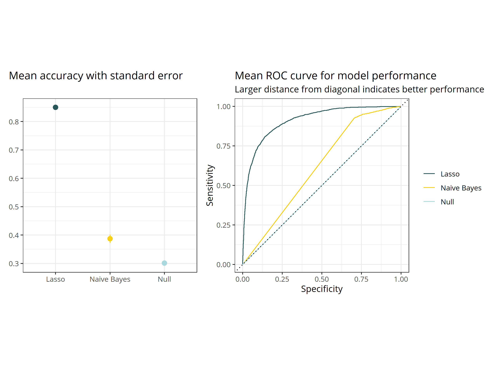
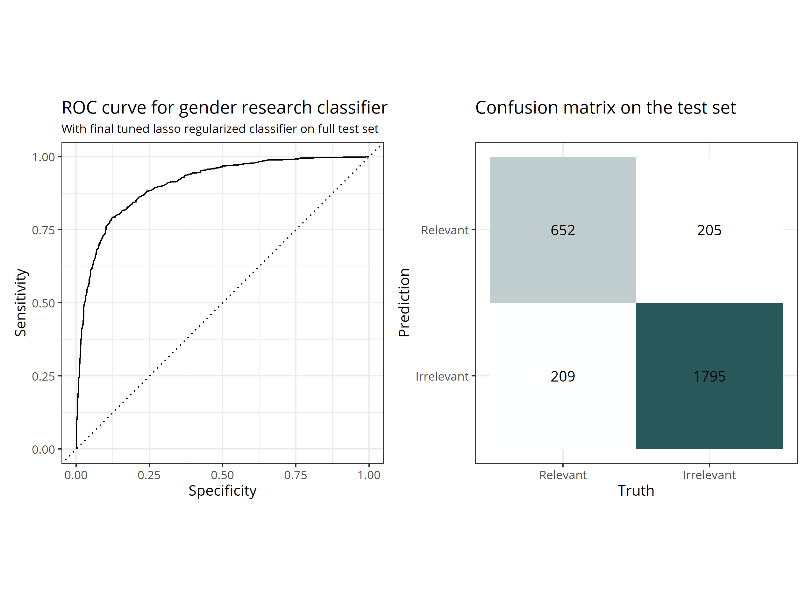
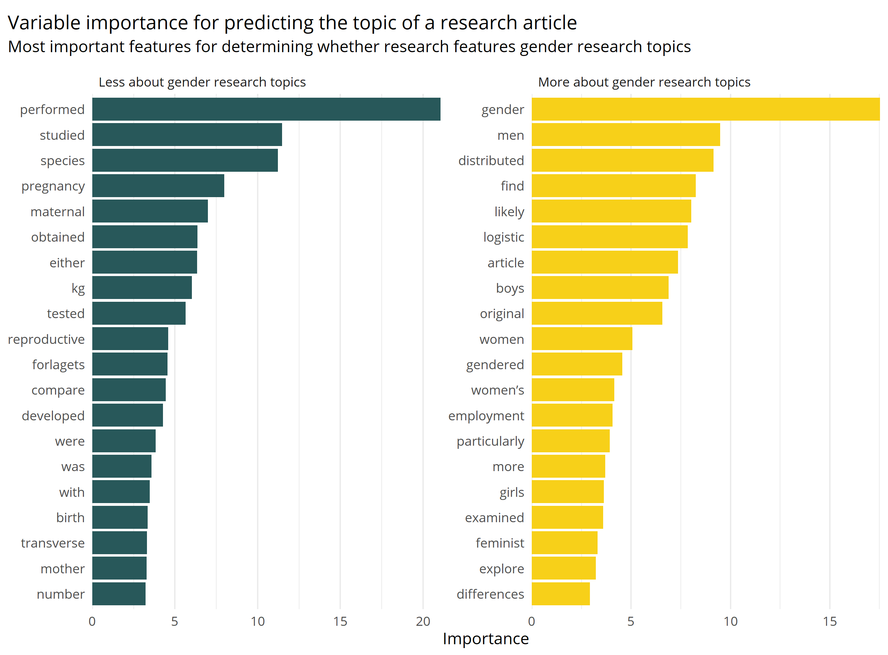

<!-- README.md is generated from README.Rmd. Please edit that file -->

# Gender research classifier

This is an example of a machine learning model to determine whether a
particular text is likely to be research with perspectives on gender.
The model is trained on a data set of 11447 Norwegian research articles
that have been manually classified as part of a project to describe
Norwegian research with gender perspectives (see [the project page for
details](https://osf.io/gm9wb/).

This repository contains the training data, a script for training
different types of classification models (a null model for evaluation
benchmarking, a naive Bayes model and a lasso regularized regression
model) and evaluating them, and a script for tuning the chosen
regression model for better model performance. It also contains the
model object itself.

# Model training and evaluation

After training three models using the default parameters, the following
accuracy and ROC curve metrics were observed:

On the basis of the superior performance of the default lasso regression
model, this was chosen for further tuning, resulting in the following
post-tuning and fitting performance:

# Variable importance

The presence of the following features were found to contribute the most
to choice of classification:

